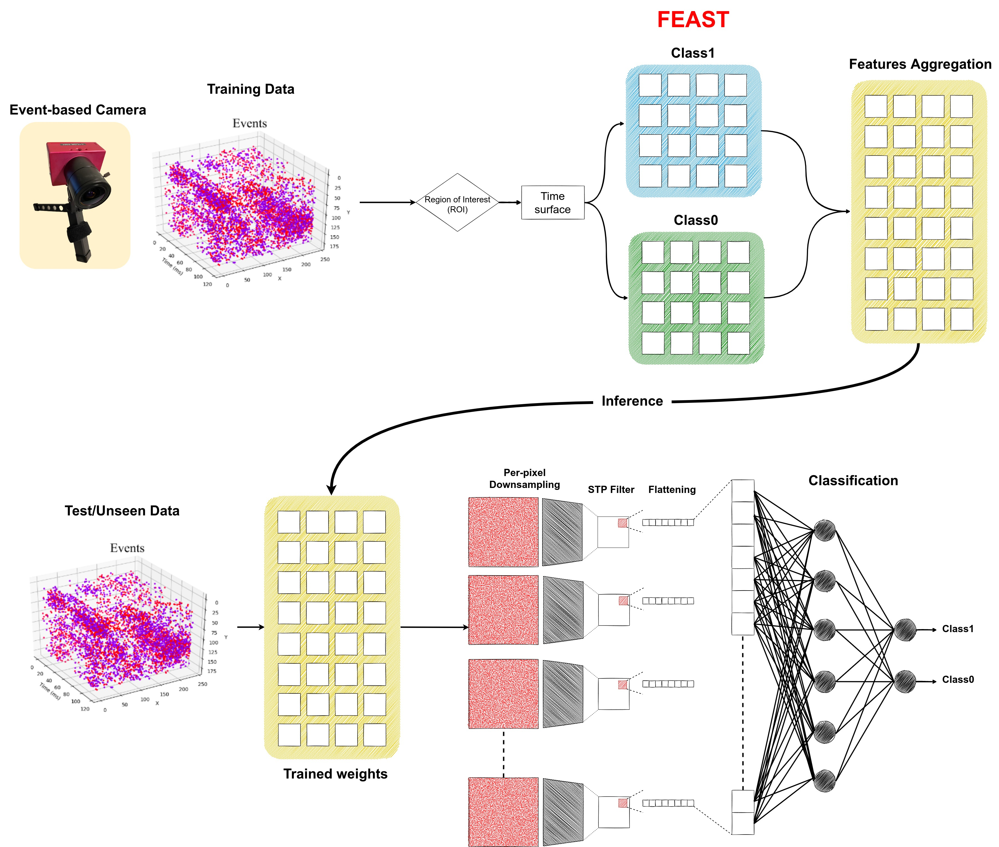

Python implementation of the [FEAST](https://www.researchgate.net/publication/339920101_Event-Based_Feature_Extraction_Using_Adaptive_Selection_Thresholds) algorithm including training and inference.

